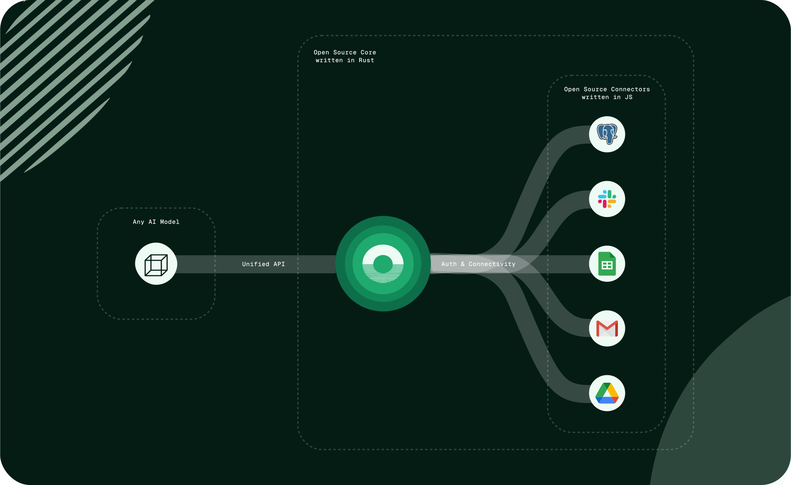

# Pica AI SDK

The Pica AI SDK is a TypeScript library for integrating Pica with [Vercel's AI SDK](https://www.npmjs.com/package/ai).



## Installation

```bash
npm install @picahq/ai
```

# Setup

1. Create a new [Pica account](https://app.picaos.com)
2. Create a Connection via the [Pica Dashboard](https://app.picaos.com/connections)
3. Create a [Pica API key](https://app.picaos.com/settings/api-keys)
4. Set the API key as an environment variable: `PICA_SECRET_KEY=<your-api-key>`


## Usage

The Pica AI SDK is designed to work seamlessly with [Vercel AI SDK](https://www.npmjs.com/package/ai). Here's an example implementation:

### Express Example

1. **Install dependencies**

```bash
npm install express @ai-sdk/openai ai @picahq/ai dotenv
```

2. **Create the server**

```typescript
import express from "express";
import { openai } from "@ai-sdk/openai";
import { generateText } from "ai";
import { Pica } from "@picahq/ai";
import * as dotenv from "dotenv";

dotenv.config();

const app = express();
const port = process.env.PORT || 3000;

app.use(express.json());

app.post("/api/ai", async (req, res) => {
  try {
    const { message } = req.body;

    // Initialize Pica
    const pica = new Pica(process.env.PICA_SECRET_KEY);

    // Generate the system prompt
    const systemPrompt = await pica.generateSystemPrompt();

    // Create the stream
    const { text } = await generateText({
      model: openai("gpt-4o"),
      system: systemPrompt,
      tools: { ...pica.oneTool },
      prompt: message,
      maxSteps: 5,
    });

    res.setHeader("Content-Type", "application/json");
    
    res.status(200).json({ text });
  } catch (error) {
    console.error("Error processing AI request:", error);

    res.status(500).json({ error: "Internal server error" });
  }
});

app.listen(port, () => {
  console.log(`Server is running on port ${port}`);
});

export default app;
```

3. **Test the server**

```bash
curl --location 'http://localhost:3000/api/ai' \
--header 'Content-Type: application/json' \
--data '{
    "message": "What connections do I have access to?"
}'
```

### Next.js Example

```typescript
import { openai } from "@ai-sdk/openai";
import { convertToCoreMessages, streamText } from "ai";
import { Pica } from "@picahq/ai";

export async function POST(request: Request) {
  const { messages } = await request.json();

  const pica = new Pica(process.env.PICA_SECRET_KEY as string);

  const systemPrompt = await pica.generateSystemPrompt();

  const stream = streamText({
    model: openai("gpt-4"),
    system: systemPrompt,
    tools: { ...pica.oneTool },
    messages: convertToCoreMessages(messages),
    maxSteps: 5,
  });

  return (await stream).toDataStreamResponse();
}
```

> ⭐️ You can see a full Next.js demo of the Pica AI SDK in action [here](https://github.com/picahq/onetool-demo)


